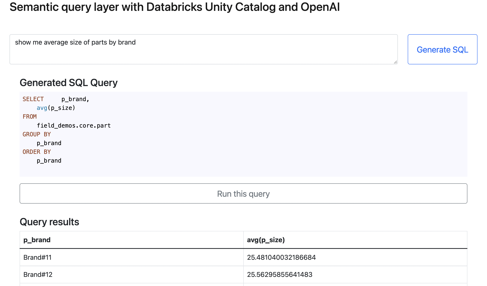
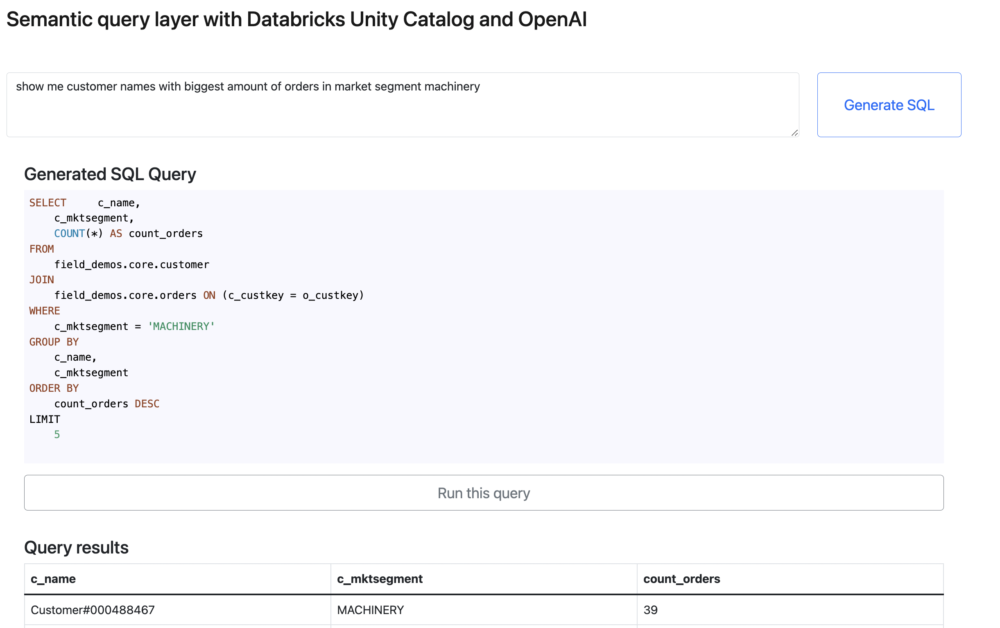
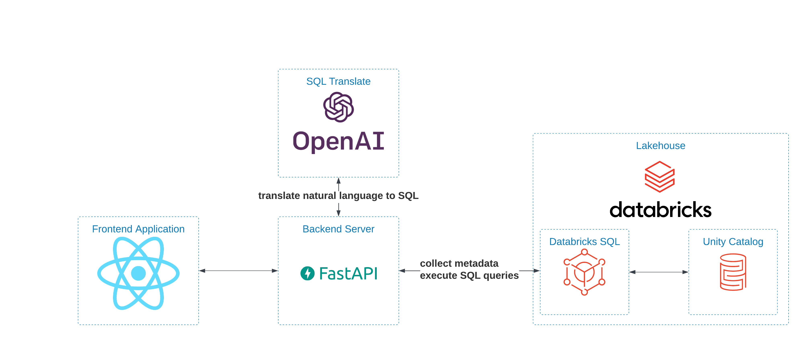

Using OpenAI with Databricks SQL for queries in natural language
================================================================

This is an example application which uses OpenAI, Databricks Unity Catalog and DBSQL to convert natural language queries into SQL and execute it against DBSQL.

.. contents:: :local:

Read more about this example project `here <https://polarpersonal.medium.com/using-openai-with-databricks-sql-for-queries-in-natural-language-cf6521e88148>`_.

Examples
--------

Technologies used
-----------------

* `Databricks Unity Catalog <https://databricks.com/product/unity-catalog>`_ provides metadata about catalogs, schemas and tables
* `OpenAI API <https://beta.openai.com/examples/default-sql-translate>`_ provides API to generate SQL statements from the natural language
* `Databricks SQL <https://databricks.com/product/databricks-sql>`_ is the execution engine to run the generated SQL statements
* `React <https://reactjs.org/>`_ for the frontend application

  * `React Bootstrap <https://react-bootstrap.github.io/>`_ for layout and components style
  * `React Syntax Highlighter <https://github.com/react-syntax-highlighter/react-syntax-highlighter>`_ for SQL syntax highlighting
  * `Axios <https://github.com/axios/axios>`_ - HTTP client, used for backend communication
  * `React Bootstrap Table <https://react-bootstrap-table.github.io/react-bootstrap-table2/>`_ - for table visualization

* `FastAPI <https://fastapi.tiangolo.com/>`_ for the backend server 
* `Databricks SQL Connector <https://docs.databricks.com/dev-tools/python-sql-connector.html>`_ to communicate with DBSQL endpoint
* `OpenAI Python API <https://github.com/openai/openai-python>`_ - for API calls from backend

Solution architecture
-----------------------

How to use
----------

1. :code:`git clone https://github.com/renardeinside/databricks-uc-semantic-layer.git`
2. Get your DBSQL endpoint coordinates from the UI
3. Get your OpenAI API key 
4. Generate the data using the job defined in :code:`./uc-semantic-layer`:

  1. Configure the catalog and schema in :code:`./uc-semantic-layer/conf/data_preparation.yml`
  2. Run the job (either on the interactive or  as a job):

.. code-block:: bash
    
    cd uc-semantic-layer
    # install dbx and other relevant libraries
    pip install -r unit-requirements.txt
    # optional - configure dbx to use another profile (by default it uses the DEFAULT one)
    dbx configure -e default --profile=<some-other-profile-name>
    # this is to execute on an interactive cluster
    dbx execute --job=semantic-layer-data-preparation --cluster-name=<interactive-cluster-name> 
    # this is to launch on automated one, please configure your node_type_id in conf/deployment.yml
    dbx deploy --job=semantic-layer-data-preparation --files-only
    dbx launch --job=semantic-layer-data-preparation --as-run-submit --trace
    cd .. # back to the project root

5. Setup the relevant variables in :code:`.env` file (check :code:`.env.example` for a reference).
6. Start the services:

.. code-block:: bash

    make launch

7. Open http://localhost:3000 and enjoy the app! 
